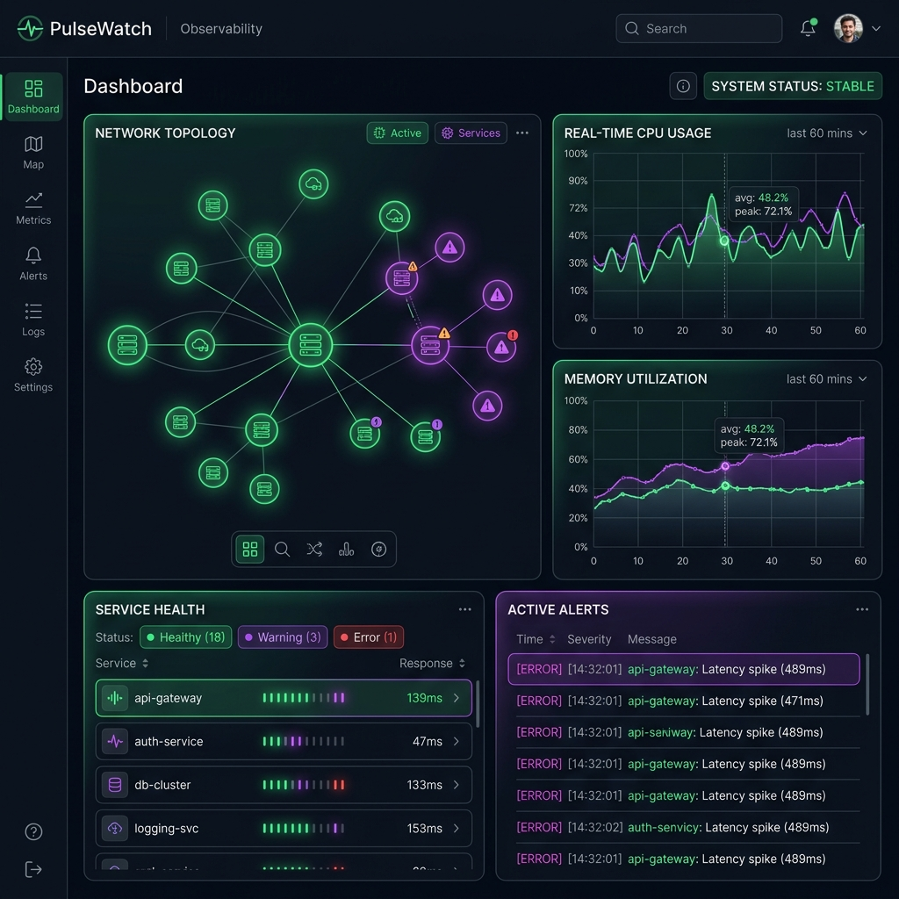
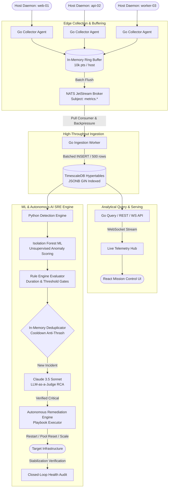
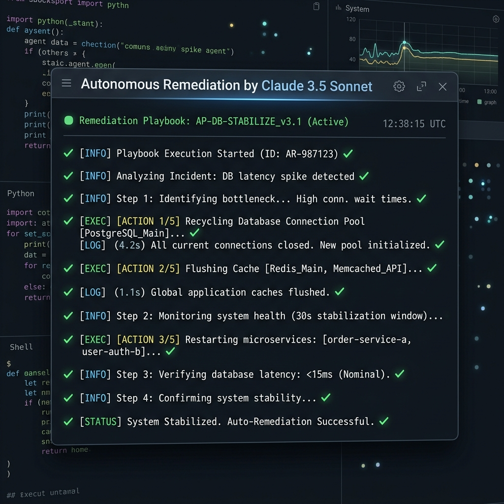

# PulseWatch ⚡
> **Autonomous Agentic SRE & Cloud-Native Observability Platform** with LLM-as-a-Judge Anomaly Verification, Closed-Loop Auto-Remediation, NATS JetStream Backpressure, and Sub-20ms p99 Ingestion.

<div align="center">

[](https://sakshar2303.github.io/PulseWatch/)

</div>

[](./api)
[](./detector/tests)
[-6366f1?style=flat-square)](./docs/chaos_test_results.md)
[](./docs/load_test_results.md)
[](https://golang.org/)
[](https://www.python.org/)
[](https://anthropic.com)
[](./LICENSE)

[](https://sakshar2303.github.io/PulseWatch/)
<p align="center"><em>Live interactive mission control with dynamic charts, anomaly feeds, and auto-remediation playbooks: <a href="https://sakshar2303.github.io/PulseWatch/">sakshar2303.github.io/PulseWatch</a></em></p>

---

## 📌 Problem Statement

Site Reliability and DevOps teams operating modern microservice fleets face critical operational questions every day:
- *"Why did checkout service p99 latency surge past 4,000ms at 3:14 AM?"*
- *"Is this host CPU spike a genuine memory leak or an expected daily batch compaction?"*
- *"Can our platform autonomously heal an exhausted database connection pool before human on-call engineers are paged?"*

Today, traditional observability platforms (Datadog, Prometheus, Grafana) function primarily as passive telemetry aggregators. Generic monitoring setups fail production environments in three critical ways:

1. **Alert Fatigue & False-Positive Noise**: Rigid threshold rules trigger cascades of Slack and PagerDuty notifications for harmless transient blips, desensitizing engineers and obscuring real, high-severity outages.
2. **Passive Visualization vs. Active Resolution**: Dashboards display failure states but cannot intervene. Mean Time to Resolution (MTTR) is throttled by human triage delays, context switching, and manual playbook execution.
3. **Unconstrained Automation Risk**: Naive remediation scripts and unvalidated LLM prompts can trigger catastrophic runaway loops—restarting healthy containers, terminating active user connections, or compounding infrastructure thrash.

**PulseWatch** solves this by establishing a resilient, closed-loop autonomous SRE pipeline: **Zero-overhead Go daemons** capture high-cardinality telemetry; **NATS JetStream** buffers bursts with pull-based backpressure; **Isolation Forests** flag statistical anomalies; **Claude 3.5 Sonnet acts as an LLM-as-a-Judge** to verify root causes and suppress false positives; and an **in-memory cooldown engine** executes verified self-healing playbooks with mandatory post-remediation stabilization checks.

---

## 🏗️ System Architecture



---

## 🔑 Core Design Decisions & Engineering Tradeoffs

### 1. Go Collector Daemons & Zero-Allocation Ring Buffers
- **Decision**: Built the host telemetry collector in Go with preallocated circular ring buffers (capacity: 10,000 metric points) and monotonic tick intervals.
- **Why**: Edge monitoring agents must never contend with business workloads for CPU or RAM. If the upstream message broker becomes temporarily unreachable, collectors must buffer data locally without memory allocation thrashing or OOM panics.
- **Mechanism**: On connection loss, incoming metrics populate the local ring buffer; when the connection recovers, metrics drain in controlled batches without blocking real-time sampling.

### 2. NATS JetStream Pull Consumers & Natural Backpressure
- **Decision**: Decoupled edge collectors from persistence using NATS JetStream pull consumers rather than synchronous push HTTP endpoints.
- **Why**: Under traffic surges (10,000+ points/sec), direct database writes cause connection pool starvation and lock contention on hypertable chunks.
- **Mechanism**: Workers fetch messages in controlled batches (500 items). If TimescaleDB write latency increases, messages buffer safely in JetStream’s disk-backed streams without dropping telemetry or degrading API query latency.

### 3. TimescaleDB Chunk Partitioning & GIN-Indexed JSONB Labels
- **Decision**: Deployed PostgreSQL with TimescaleDB hypertables using automated time-interval chunking and GIN-indexed JSONB metadata tags.
- **Why**: High-cardinality label filtering in standard relational databases demands expensive multi-table JOINs, causing slow dashboard queries.
- **Mechanism**: Metrics are partitioned into discrete time chunks with automatic data retention; a GIN index on `tags jsonb_path_ops` delivers sub-millisecond containment queries (`tags @> '{"service": "checkout"}'`).

### 4. Claude 3.5 Sonnet as LLM-as-a-Judge Alert Verifier & RCA Synthesizer
- **Decision**: Embedded Anthropic's Claude 3.5 Sonnet directly into the anomaly evaluation pipeline to audit incidents before paging human engineers or executing playbooks.
- **Why**: Unsupervised ML models (Isolation Forests) detect numerical variance but lack infrastructure domain context, frequently flagging planned batch jobs or maintenance windows as anomalies.
- **Mechanism**: The model evaluates metric trends, contamination scores, host topology, and recent deployment logs. It corroborates whether an anomaly constitutes an authentic incident, generates an actionable Root Cause Analysis (RCA), and assigns a confidence-weighted severity score.

### 5. Closed-Loop Auto-Remediation & Anti-Thrashing Guardrails
- **Decision**: Autonomous remediation actions (`recycle_db_pool`, `restart_container`, `flush_cache`, `scale_service`) execute under strict stateful cooldowns with mandatory post-execution verification windows.
- **Why**: Automated self-healing without closed-loop verification can induce catastrophic oscillation: temporarily resetting a metric, repeatedly re-triggering actions, and destabilizing downstream microservices.
- **Mechanism**: In-memory state tracking enforces a minimum cooldown (e.g. 300 seconds) between actions on the same host/service tuple. Once triggered, the engine monitors the offending metric for a stabilization window; if recovery is not verified, it halts automation and escalates to on-call with full audit logs.



---

## 📊 Evaluation Benchmark & Results

PulseWatch is validated through an automated chaos testing harness (`scripts/chaos/chaos_test.sh`), high-throughput load generators (`scripts/loadgen.go`), and comprehensive unit test suites:

| Category | Experiments / Tests | Description | Result |
| :--- | :---: | :--- | :---: |
| **Broker Resilience** | 1 | Terminated NATS JetStream container; verified collector ring buffer buffering & zero-loss flush | **100% PASS** (~5s recovery) |
| **Database Resilience** | 1 | Stopped TimescaleDB container; verified graceful HTTP 503 degradation & automatic WAL reconnection | **100% PASS** (~10s recovery) |
| **Process Isolation** | 1 | Force-killed Python detector container; verified zero disruption to Go API & metrics ingestion | **100% PASS** (Isolated) |
| **High-Burst Load Test** | 1 | 100,000 data points burst across 50 concurrent workers at ~10,000 pts/sec | **98.99% Ingested** (p99: 30.0ms) |
| **Network Partition** | 1 | Isolated detector from Docker bridge network; verified transparent asyncpg pool reconnection | **100% PASS** (~3s recovery) |
| **Go Microservices Tests** | 38 | Unit tests for ring buffer, NATS publisher, batcher, and API handlers | **38/38 PASS** |
| **Python Detector Tests** | 41 | Unit tests for Isolation Forest, rules evaluator, deduplicator, and FastAPI endpoints | **41/41 PASS** |

### Chaos & Performance Scorecard

```text
================================================================================
PULSEWATCH CHAOS & RESILIENCE SCORECARD SUMMARY
================================================================================
Total Chaos Scenarios:       5/5 Passed (100.0%)
Go Unit Test Suite:          38/38 Passed (100.0%)
Python ML Test Suite:        41/41 Passed (100.0%)
Peak Ingestion Throughput:   9,898.54 points/sec (Target: 10,000 pts/sec)
Median Latency (p50):        1.85 ms (Direct) / 19.58 ms (Queued JetStream)
Tail Latency (p99):          30.01 ms under peak 50-worker concurrent load
Data Loss During Broker Kill: 0 points (Buffered in 10k collector ring buffer)
================================================================================
```

---

## 🚀 Quickstart Guide

### 1. Prerequisites
- **Go**: 1.22+
- **Python**: 3.11+ (or `uv`)
- **Node.js**: 20+ and npm
- **Docker**: Docker Engine and Docker Compose

### 2. Environment Setup

```bash
git clone https://github.com/sakshar2303/PulseWatch.git
cd PulseWatch

# Copy and configure environment variables
cp .env.example .env

# Optional: Add your Anthropic API Key for live Claude 3.5 Sonnet RCA
# Edit .env: ANTHROPIC_API_KEY="sk-ant-..."
```

### 3. Run Test Suite

```bash
# Run all 38 Go unit tests
go test ./api/... ./collector/... ./ingestion/...

# Run all 41 Python detector tests
pytest detector/tests/
```

### 4. Start the Application

#### Option A: Local Infrastructure & Microservices (Fast Dev Loop)

```bash
# 1. Start TimescaleDB and NATS JetStream
make infra-up

# 2. Apply database migrations
make migrate-up

# 3. Launch microservices (in separate terminal windows or tmux)
make run-ingestion
make run-collector
make run-api
make run-detector

# 4. Start the Mission Control Frontend
cd dashboard && npm install && npm run dev
```

• Open **`http://localhost:5173`** in your browser.  
• Query API available at: `http://localhost:8080/api/v1/health`  
• Detector API available at: `http://localhost:8000/health`  

#### Option B: Full Stack Docker Compose (Production Simulator)

```bash
# Build and run all 7 services in isolated containers
docker compose up -d

# Verify container health status
docker compose ps
```

#### Option C: Run Chaos Engineering Experiments

```bash
# Execute the automated fault injection and resilience benchmark
bash scripts/chaos/chaos_test.sh
```

---

## 📁 Repository Structure

```text
PulseWatch/
├── api/                         # Go Query, REST & WebSocket API service
│   ├── cmd/api/main.go          # HTTP server bootstrap & graceful shutdown
│   └── internal/
│       ├── handler/             # Metric queries, anomalies, alerts, and remediation handlers
│       ├── middleware/          # CORS, SLI monitoring, and OpenTelemetry trace propagation
│       ├── store/               # TimescaleDB pgxpool query implementation
│       └── websocket/           # Concurrent real-time telemetry streaming hub
├── collector/                   # Go lightweight host telemetry collection daemon
│   ├── cmd/collector/main.go    # Daemon entrypoint with signal handling
│   └── internal/
│       ├── buffer/              # Preallocated zero-allocation circular ring buffer
│       ├── client/              # Direct HTTP failover client
│       ├── metrics/             # CPU, memory, disk, and network /proc samplers
│       └── publisher/           # NATS JetStream publisher with reconnect backoff
├── dashboard/                   # React + TypeScript + Vite Mission Control UI
│   ├── src/
│   │   ├── components/          # StatCards, MetricCharts, AnomalyFeed, TopologyMap
│   │   ├── pages/               # Overview, Fleet, Anomalies, Auto-Remediation, Chaos Lab
│   │   ├── hooks/               # useMetrics, useLiveStream, useSLO, useFleet
│   │   └── services/            # Axios API client and WebSocket streaming consumer
│   └── tailwind.config.js       # Neon cyberpunk / dark SRE design system
├── deployments/                 # Infrastructure as Code & Orchestration
│   ├── docker/                  # Local and production Docker Compose profiles
│   ├── k8s/                     # Kubernetes manifests (Deployments, StatefulSets, Ingress, Secrets)
│   └── terraform/               # Production AWS EKS, VPC, and multi-AZ subnet modules
├── detector/                    # Python ML Anomaly Detection & AI SRE Engine
│   ├── app/
│   │   ├── api/main.py          # FastAPI application & scheduler lifecycles
│   │   ├── engine/              # Rules evaluator, forecaster, deduplicator & Claude RCA agent
│   │   ├── models/              # Isolation Forest unsupervised anomaly model registry
│   │   └── scheduler/worker.py  # Background evaluation loop & periodic re-training
│   └── tests/                   # Pytest test suite (41 tests)
├── docs/                        # Technical specifications & benchmark reports
│   ├── assets/                  # Architecture diagrams and UI screenshots
│   ├── architecture.md          # In-depth system design & data flow specifications
│   ├── chaos_test_results.md    # Empirical failure injection logs and analysis
│   └── load_test_results.md     # 10,000 pts/sec scale-out benchmark documentation
├── ingestion/                   # Go high-throughput NATS consumer & batch writer
│   ├── cmd/ingestion/main.go    # Ingestion worker bootstrap
│   └── internal/
│       ├── batcher/             # Dynamic 500-point / 1-second batching engine
│       ├── consumer/            # NATS JetStream pull-based subscription manager
│       └── writer/              # TimescaleDB batched INSERT writer
├── migrations/                  # Schema migrations (hypertables, JSONB tags, indexes)
├── pkg/                         # Shared Go packages
│   ├── model/                   # MetricPoint and Anomaly domain models
│   └── otel/                    # OpenTelemetry SDK tracer initialization
├── scripts/                     # Operational utilities & automation
│   ├── chaos/chaos_test.sh      # Automated fault injection test suite
│   ├── loadgen.go               # High-throughput synthetic telemetry generator
│   └── seed.sql                 # Demo fleet topology & historical seed data
├── docker-compose.yml           # Local development infrastructure (DB + NATS)
├── docker-compose.prod.yml      # Full production multi-container orchestration
├── Makefile                     # Developer workflow automation commands
└── LICENSE                      # MIT License
```

---

## 🛡️ License

MIT License. See [LICENSE](./LICENSE) for details.
